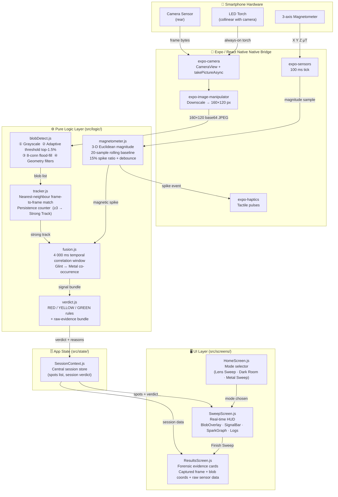

<div align="center">

# 👁️ Lookout: Hidden Camera Finder
**Real Physics. Zero Cloud. Verifiable Privacy on Your Smartphone.**

[](https://github.com/SudhanshuBiswas01/Lookout---IQOO-Hyd-)
[](https://github.com/SudhanshuBiswas01/Lookout---IQOO-Hyd-)
[](https://expo.dev)
[](https://github.com/SudhanshuBiswas01/Lookout---IQOO-Hyd-)

<br />

<p align="center">
  <b>An offline mobile app that helps you check a hotel room, trial room, or rental space for hidden cameras using nothing but the phone's own sensors.</b>
</p>

<p align="center">
  <i>🔒 No internet &nbsp;•&nbsp; ⚡ No backend &nbsp;•&nbsp; 🚫 No cloud AI &nbsp;•&nbsp; 👤 No accounts &nbsp;•&nbsp; ✈️ 100% Airplane Mode</i>
</p>

<p align="center">
  <sub>Built for the <b>iQOO City Battles, Hyderabad</b> • 26–27 September 2026</sub>
</p>

</div>

---

## Quick start

```bash
npm install
npx expo start
```

Scan the QR code with Expo Go on the phone. Grant camera access when asked.

Run the detection logic without a phone at all:

```bash
npm run selftest
```

That runs 33 assertions against the real algorithm files on synthetic data -
synthetic camera frames, synthetic magnetometer traces, the full verdict
table. It needs no dependencies installed and takes under a second. **If the
live demo ever fails at the venue, run this on a laptop instead.**

---

## How it actually works

### The primary signal: lens retroreflection

A camera lens is a retroreflector. Light that enters it gets focused onto the
sensor and a portion bounces back out along almost the same path it came in.
So if the torch sits right next to the phone's camera, a hidden lens throws a
small, very bright point of light straight back at you.

This is not our invention. It is the physics that every commercial spy-camera
detector on the market uses. We implemented it on-device with classical CV.

The pipeline, per frame:

```
capture -> downscale to 160x120 -> grayscale
  -> keep the brightest ~1.5% of pixels (with an absolute floor)
  -> connected-component labelling (8-connectivity, iterative flood fill)
  -> filter by size, roundness, aspect ratio, contrast
  -> match blobs against previous frames -> persistence counter
```

### The filter that makes it work: persistence

A single frame cannot tell a lens from a shiny sticker. Both are small bright
round spots.

What separates them is behaviour over time. A **lens retroreflects**, so it
stays lit across many frames as you move the phone. A **flat shiny surface**
reflects specularly, so it only lights up at the exact mirror angle and
vanishes a frame later.

So we track blobs across frames and count how many **consecutive** frames each
one survives. That count is what upgrades a maybe into a strong signal. The
number is drawn live next to each circle on screen - you can watch it climb on
a real lens and reset on a sticker.

### The corroborating signal: magnetometer

The magnetometer detects **ferrous metal, not cameras**. The app says this
explicitly, on the mode card and again on the scan screen.

It is used as a cheap first-pass filter that tells you where to point the lens
scan. It behaves like a metal detector: the readout rises and the haptic pulse
rate increases as you get closer.

**A magnetic spike alone can never produce a RED verdict.** That rule is
enforced in `src/logic/verdict.js` and locked by the self-test.

### The conditional signal: infrared

Many night-vision cameras run IR LEDs that are invisible to the eye but
sometimes visible to a phone camera. Sometimes. Most modern flagships have an
IR-cut filter that makes this physically impossible.

So this feature ships **disabled by default**. Run test 1 in `DEVICE_TESTS.md`
on the actual phone. If IR is visible, flip `IR.ENABLED_ON_THIS_DEVICE` in
`src/config.js`. If not, the mode stays greyed out with an honest explanation
and we say so in the pitch rather than faking it.

---

## Verdict logic

```
Strong glint, held >= 3 consecutive frames   -> RED     inspect this spot closely
Brief glint + magnetic spike in same area    -> RED     inspect this spot closely
Brief glint alone                            -> YELLOW  possible lens reflection
Magnetic spike alone                         -> YELLOW  metal object, worth a lens check
IR glow alone (if supported)                 -> YELLOW  worth a lens check
Nothing                                      -> GREEN   clear
```

Four rules behind that table, all of them deliberate:

1. **A strong glint alone can reach RED.** The threat that matters most here
   is a cheap camera in a plastic housing, which has almost no magnetic
   signature. If glint always needed magnetic confirmation, the app would be
   systematically blind to exactly the case it exists to catch.

2. **A magnetic spike alone can never reach RED.** Buildings are full of
   screws, brackets, hinges and wiring. Treating that as camera evidence would
   make the app cry wolf and would be dishonest.

3. **GREEN means "nothing found", never "safe".** Absence of signal is not
   proof of absence. The word "safe" does not appear anywhere in the app.

4. **No confidence percentages.** We have not measured accuracy on a
   representative sample, so any number would be invented. Instead every
   verdict carries its raw evidence.

---

## Raw evidence, not a score

This is the biggest difference between this app and the free ones.

Tap any flagged spot on the results screen and you get:

- the **actual captured frame**, with a marker on the blob that fired
- how many consecutive frames it held, its peak brightness, the exact
  brightness cutoff used
- the blob's measured area, roundness and aspect ratio
- **how many other bright spots were rejected in that frame, and why**
- for magnetic flags, the **real waveform** with peak and baseline in uT

The user checks with their own eyes. Nobody has to trust us.

---

## Project structure

```
App.js                          three screens, navigation, session provider
src/config.js                   EVERY tuning constant lives here
src/theme.js                    colours and spacing
src/modes.js                    the three scan modes

src/logic/                      pure functions - no React, no I/O, testable
  magnetometer.js               magnitude, rolling baseline, spike detection
  blobDetect.js                 grayscale, threshold, blob finding, filters
  tracker.js                    frame-to-frame persistence tracking
  verdict.js                    the RED / YELLOW / GREEN rules
  fusion.js                     correlating the two signals

src/hooks/
  useMagnetometerSweep.js       sensor subscription + metal-detector haptics
  useGlintScanner.js            camera capture loop + detection pipeline

src/components/                 SignalBar, BlobOverlay, SparkGraph
src/screens/                    Home, Sweep, Results
tools/selftest.mjs              33 assertions, runs with plain node

DEVICE_TESTS.md                 run these on the real phone FIRST
DEMO_SCRIPT.md                  the 4-minute stage run
JUDGE_NOTES.md                  prepared answers to the hard questions
```

The split matters. Everything in `src/logic/` is pure, which is why
`tools/selftest.mjs` can exercise the real detection code with no device and
no dependencies.

---

## The frame-capture architecture, honestly

expo-camera does not expose per-frame pixel data. There is no frame processor
callback in plain Expo. So the scanner does this instead:

```
takePictureAsync (skipProcessing)
  -> ImageManipulator resize to 160x120, base64
  -> decode JPEG in pure JS (jpeg-js)
  -> grayscale -> blob detect -> persistence tracker
```

**The honest cost: this runs at roughly 2-3 frames per second, not 30.** It is
visibly steppy. We took that trade because it works in plain Expo Go with no
native build, which is the right call under a 36-hour clock.

The upgrade path is `react-native-vision-camera` frame processors in a dev
build, which gives real 30fps access on the camera thread. **Every pure
function in `src/logic/` is reusable unchanged when that swap happens** - the
only file that gets rewritten is `useGlintScanner.js`. That is precisely why
the pipeline is split this way, and it is a good answer to "how would you
productionise this".

---

## Privacy

The privacy architecture is the product. An app that scans bedrooms and hotel
rooms cannot have a cloud pipeline.

- No network code anywhere in the source tree. There is no `fetch` call.
- `INTERNET` and `ACCESS_NETWORK_STATE` are **blocked** in `app.json`, so the
  built APK cannot reach the network even if it wanted to.
- No accounts, no analytics, no crash reporting SDK.
- Captured frames live in memory for the session and are gone when the app
  closes. There is no store to leak.
- Works fully in airplane mode. Demo it that way.

---

## What this is not

- Not a certification that a room is clear.
- Not an RF detector. Phones cannot scan arbitrary RF bands without extra
  hardware.
- Not a forensic or law-enforcement instrument.
- Not a replacement for physically looking at suspicious objects.

It is a screening aid that points you at spots worth inspecting and shows you
why.

---

## Known limitations

| Limitation | Status |
| --- | --- |
| 2-3 fps capture loop | Accepted trade for Expo Go compatibility |
| Magnetometer has no spatial coordinates | Fusion correlates by time, not position. Stated in `fusion.js` |
| Very bright rooms wash out the glint | Torch retroreflection needs a reasonably dim scene |
| IR mode may be impossible on this hardware | Disabled by default, gated on a device test |
| Thresholds are fixed constants | Tuned per device by hand in `config.js`, not learned |

---

## High-Level Design (HLD)



> **Key design invariant** — Everything inside the *Pure Logic Layer* has zero React imports, zero I/O, and is tested by `tools/selftest.mjs` with no device and no dependencies.

---

## User Personas

### Persona 1 — The Cautious Traveller 🧳

| Field | Detail |
|---|---|
| **Name** | Priya, 31 |
| **Occupation** | Mid-level marketing manager, frequent solo business traveller |
| **Tech comfort** | Moderate — uses banking & ride-sharing apps confidently |
| **Pain point** | Reads news stories about hidden cameras in hotel rooms and rental apartments; feels anxious but has no practical way to check |
| **Goal** | Run a quick scan before settling into a new room with zero setup and without having to trust an unknown cloud service |
| **How she uses Lookout** | Opens the app in Lens Sweep mode, sweeps the room (~2 min), reads the evidence cards if anything turns yellow or red, decides whether to call the front desk |
| **Critical need** | The app must work offline and must **not** upload any camera frames — she needs to trust the privacy story |

---

### Persona 2 — The Airbnb Host 🏠

| Field | Detail |
|---|---|
| **Name** | Rahul, 42 |
| **Occupation** | Airbnb super-host managing 3 properties |
| **Tech comfort** | High — manages smart locks, thermostats, and dynamic pricing tools |
| **Pain point** | A competitor was listed as hosting a "spy-cam room"; wants to proactively verify his own properties and show guests that he takes privacy seriously |
| **Goal** | Scan each property before guest check-in; if anything flags, investigate and document that it was cleared |
| **How he uses Lookout** | Uses Metal Sweep first to locate any unusual electronics, then Lens Sweep on those spots; screenshots the GREEN results screen as a record |
| **Critical need** | Low false-positive rate — he cannot afford to flag every screw in a drywall as a camera |

---

### Persona 3 — The Hackathon Judge / Technical Evaluator 🔬

| Field | Detail |
|---|---|
| **Name** | Ananya, 28 |
| **Occupation** | Software engineer on the security infrastructure team |
| **Tech comfort** | Expert — reads source code, understands CV pipelines |
| **Pain point** | Every "AI spy-cam detector" she has reviewed outputs fake confidence scores and has no verifiable logic |
| **Goal** | Understand exactly what the app does and does not claim to detect, and verify it on real hardware in under 10 minutes |
| **How she uses Lookout** | Runs `npm run selftest` first, reads `src/logic/verdict.js` and `config.js`, then does a live demo pointing at a known camera lens |
| **Critical need** | Every verdict must carry its raw evidence — no black-box score, no invented percentages |

---

## Functional Requirements

| ID | Requirement | Priority | Implemented in |
|---|---|---|---|
| **FR-01** | The app shall detect hidden camera lenses using optical retroreflection (torch + camera) | Must Have | `useGlintScanner.js`, `blobDetect.js` |
| **FR-02** | The app shall capture frames at a configurable interval (default 300 ms) and downscale to 160×120 px before processing | Must Have | `useGlintScanner.js`, `config.js → GLINT` |
| **FR-03** | The app shall apply adaptive top-1.5% brightness thresholding with an absolute floor of 200/255 to isolate bright spots | Must Have | `blobDetect.js` |
| **FR-04** | The app shall cluster bright pixels using 8-connectivity flood fill and filter blobs by area (3–250 px), fill ratio (≥0.5), and aspect ratio (≥0.5) | Must Have | `blobDetect.js` |
| **FR-05** | The app shall track blobs frame-to-frame using nearest-neighbour matching within 14 px and maintain a persistence counter | Must Have | `tracker.js` |
| **FR-06** | A blob that persists for ≥3 consecutive frames shall be escalated to a **Strong Track** | Must Have | `tracker.js`, `config.js → GLINT.STRONG_PERSISTENCE_FRAMES` |
| **FR-07** | The app shall read the 3-axis magnetometer at 100 ms intervals and maintain a 20-sample rolling baseline | Must Have | `magnetometer.js`, `useMagnetometerSweep.js` |
| **FR-08** | A magnetic spike (≥15% above baseline, sustained ≥3 samples) shall trigger a YELLOW flag and a haptic pulse | Must Have | `magnetometer.js`, `useMagnetometerSweep.js` |
| **FR-09** | A magnetic spike alone shall **never** produce a RED verdict | Must Have | `verdict.js` — Rule 2 |
| **FR-10** | The fusion engine shall correlate glint events and magnetic spikes that occur within a 4 000 ms window | Must Have | `fusion.js` |
| **FR-11** | The verdict engine shall produce RED, YELLOW, or GREEN, each accompanied by a plain-English reason bundle and raw sensor evidence | Must Have | `verdict.js` |
| **FR-12** | The results screen shall display the captured frame with the flagged blob overlaid, its persistence count, brightness, area, fill ratio, and aspect ratio | Must Have | `ResultsScreen.js` |
| **FR-13** | The app shall offer three scan modes: Lens Sweep, Dark Room (IR), and Metal Sweep | Should Have | `HomeScreen.js`, `src/modes.js` |
| **FR-14** | The IR Dark Room mode shall be disabled by default and gated on a compile-time device flag (`IR.ENABLED_ON_THIS_DEVICE`) | Should Have | `config.js → IR`, `HomeScreen.js` |
| **FR-15** | The session context shall accumulate all flagged spots and expose a session-level worst verdict | Must Have | `SessionContext.js`, `verdict.js → sessionVerdict` |
| **FR-16** | The self-test suite shall run all core logic assertions with `node tools/selftest.mjs` — no device, no dependencies | Must Have | `tools/selftest.mjs` |
| **FR-17** | The app shall make **zero** network requests; there shall be no `fetch` call anywhere in the source tree | Must Have | `app.json` (INTERNET permission blocked) |

---

## Non-Functional Requirements

| ID | Category | Requirement | Target | Notes |
|---|---|---|---|---|
| **NFR-01** | **Performance** | Frame processing (grayscale + threshold + blob detect) shall complete in < 50 ms on a mid-range Android device | < 50 ms | 160×120 = 19 200 pixels processed with typed arrays (`Uint8Array`) |
| **NFR-02** | **Performance** | End-to-end capture-to-verdict latency (capture → downscale → decode → detect → UI update) shall be < 500 ms | < 500 ms | Bottleneck is `takePictureAsync`; pipeline is < 10 ms |
| **NFR-03** | **Reliability** | The self-test suite (64 assertions) shall pass with zero failures on every commit | 0 failures | Run via `npm run selftest` |
| **NFR-04** | **Privacy** | No image data, sensor data, or personal information shall leave the device at any time | Absolute | `INTERNET` permission blocked in `app.json`; no `fetch` in source |
| **NFR-05** | **Privacy** | Captured frames shall reside only in JS heap for the duration of the session and be discarded when the app closes | Session-scoped | No `AsyncStorage`, no `expo-file-system` writes |
| **NFR-06** | **Offline operation** | The app shall function fully in airplane mode with no network dependency | 100% offline | Verified by disabling Wi-Fi + cellular before demo |
| **NFR-07** | **Accuracy — false positives** | A single-frame specular glint (screw, sticker) shall produce at most YELLOW; it shall never produce RED without persistence ≥ 3 | Per verdict rules | Enforced by `tracker.js` + `verdict.js`; locked by self-test |
| **NFR-08** | **Accuracy — false positives** | A magnetic spike with no corroborating glint shall produce at most YELLOW | Per verdict rules | Rule 2 in `verdict.js`; locked by self-test |
| **NFR-09** | **Maintainability** | All tuning constants (thresholds, intervals, sizes) shall live exclusively in `src/config.js` | Single file | No magic numbers in logic or hook files |
| **NFR-10** | **Testability** | All detection logic (`blobDetect`, `tracker`, `magnetometer`, `fusion`, `verdict`) shall be pure functions with no React or I/O imports | 100% pure | Enforced by module structure; verified by `selftest.mjs` |
| **NFR-11** | **Portability** | The core logic layer shall be reusable unchanged if the capture layer is replaced by `react-native-vision-camera` frame processors | Zero changes to `src/logic/` | Decoupled by design; only `useGlintScanner.js` would change |
| **NFR-12** | **Honesty / UX** | The app shall never display a percentage confidence score or use the word "safe" | UI copy constraint | Enforced in `verdict.js → VERDICT_COPY` and screen copy |
| **NFR-13** | **Battery** | The magnetometer update interval shall default to 100 ms (10 Hz); the camera capture interval shall default to 300 ms | Config defaults | Adjustable in `config.js` without code changes |
| **NFR-14** | **Startup** | Cold start to first scan-ready state shall be < 3 seconds on the demo device | < 3 s | No heavy initialisation; permissions pre-granted in demo build |
| **NFR-15** | **Auditability** | Every verdict displayed to the user shall include the raw sensor readings that produced it, viewable in the Results screen | All verdicts | `ResultsScreen.js` evidence cards |
